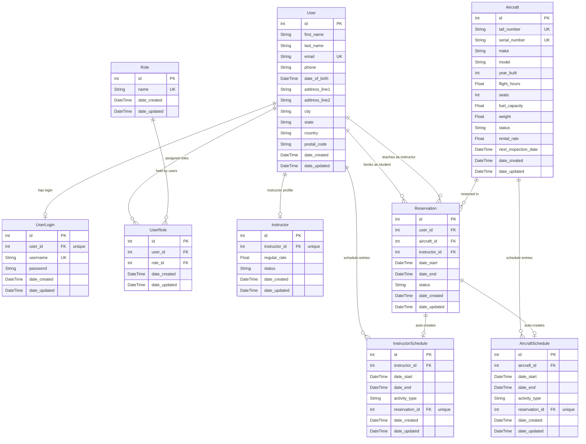

# PilotOps

**PilotOps** is a full-stack flight school management platform. It covers student and instructor management, fleet tracking, scheduling, and reservations — all in a single web application.

---

## Table of Contents

1. [Tech Stack](#tech-stack)
2. [Project Structure](#project-structure)
3. [Getting Started](#getting-started)
4. [Roles & Permissions](#roles--permissions)
5. [Features](#features)
6. [Database ER Diagram](#database-er-diagram)
7. [API Reference](#api-reference)
8. [Default Seed Accounts](#default-seed-accounts)

---

## Tech Stack

| Layer | Technology |
|---|---|
| Frontend | React 19, TypeScript, Vite, React Router v7 |
| Backend | Node.js, Express 5, TypeScript |
| ORM | Prisma v7 |
| Database | SQLite (via `@libsql/client` + `@prisma/adapter-libsql`) |
| Auth | JWT (`jsonwebtoken`), bcrypt password hashing |
| Dev tooling | `ts-node-dev` (server), Vite HMR (client) |

---

## Project Structure

```
pilot_ops/
├── client/                  # React frontend (Vite)
│   └── src/
│       ├── api/             # Typed fetch wrappers for each API group
│       ├── components/      # Shared UI components (modals, navbar, etc.)
│       ├── context/         # AuthContext — JWT token + current user
│       ├── pages/           # One file per route
│       └── types/           # Shared TypeScript interfaces
│
└── server/                  # Express backend
    ├── prisma/
    │   ├── schema.prisma    # Data model
    │   ├── migrations/      # Applied SQL migrations
    │   └── seed.ts          # Sample data seeder
    └── src/
        ├── controllers/     # Request handlers
        ├── middleware/      # authenticate, authorizeRoles
        └── routes/          # Express routers
```

---

## Getting Started

### Prerequisites

- Node.js 20+
- npm 10+

### Install

```bash
# From the repo root (npm workspaces)
npm install
```

### Environment

Create `server/.env`:

```
DATABASE_URL=file:./dev.db
JWT_SECRET=your_secret_here
PORT=3001
```

### Database setup

```bash
cd server

# Apply all migrations and generate the Prisma client
npx prisma migrate dev

# Seed sample users, aircraft, and instructor records
npm run db:seed
```

### Run in development

```bash
# Terminal 1 — API server (http://localhost:3001)
npm run dev:server

# Terminal 2 — React client (http://localhost:5173)
npm run dev:client
```

### Useful scripts

| Script | Description |
|---|---|
| `npm run dev:server` | Start the API server with hot-reload |
| `npm run dev:client` | Start the Vite dev server |
| `npm run build` | Production build for both workspaces |
| `cd server && npm run db:seed` | Re-seed the database (idempotent) |
| `cd server && npm run db:studio` | Open Prisma Studio |
| `cd server && npm run db:migrate` | Run pending migrations |

---

## Roles & Permissions

Seven roles are supported. A user can hold multiple roles simultaneously.

| Role | Description |
|---|---|
| `STUDENT` | Can view instructors and aircraft, make/cancel own reservations, view own schedule |
| `GUEST` | Limited access (same as student for reservations) |
| `PILOT` | Can fly without an instructor |
| `INSTRUCTOR` | All student permissions + access to My Schedule page |
| `STAFF` | Full read/write on users, instructors, and reservations; cannot access admin-only reports |
| `ADMIN` | Full system access including user management and role assignment |
| `OTHER` | Custom / catch-all role |

### Permission matrix for key actions

| Action | Student | Instructor | Staff | Admin |
|---|:---:|:---:|:---:|:---:|
| View instructors (active only) | ✓ | ✓ | ✓ | ✓ |
| View inactive instructors | — | — | ✓ | ✓ |
| Edit instructor rate / status | — | — | ✓ | ✓ |
| View aircraft | ✓ | ✓ | ✓ | ✓ |
| Add / edit aircraft | — | — | ✓ | ✓ |
| Make a reservation | ✓ | ✓ | ✓ | ✓ |
| View all reservations | — | — | ✓ | ✓ |
| Manage users | — | — | ✓ | ✓ |
| Assign roles | — | — | ✓ | ✓ |
| My Schedule page | — | ✓ | — | — |

---

## Features

### Dashboard (Home)

- Animated hero banner with school stats (graduates, aircraft, instructors, pass rate)
- Quick-navigation cards to all major sections

### Students (Admin / Staff only)

- Paginated, sortable user table with live search (debounced)
- Add / edit / delete users via modal form
- View full user profile in a side drawer
- Role assignment: add or remove roles per user
- Login management: create, update, or reset a user's login credentials

### Instructors

- Card grid showing name, email, and hourly rate for all **active** instructors
- Live search by name or email (client-side)
- **Admin / Staff extras:**
  - Toggle to show / hide inactive instructors
  - Edit modal to update the instructor's hourly rate and active/inactive status
  - Inactive instructors displayed with muted styling and an `INACTIVE` badge
- Inactive instructors are excluded from reservation booking dropdowns

### Aircraft

- Sortable, paginated table: tail number, make, model, year, flight hours, seats, status, rental rate, next inspection date
- Status summary cards (Ready / Maintenance / Not Available) that double as filters
- Inspection date warnings (⚠ flag when within 30 days)
- **Admin / Staff extras:**
  - Add new aircraft via form modal
  - Edit aircraft — all fields including seats, fuel capacity, weight, rental rate, and next inspection date
  - Status radio selection: Ready / Maintenance / Not Available

### Aircraft Availability (Fleet View)

- Day-view hour grid (6 AM – 9 PM) for all aircraft
- Navigate forward / backward by day
- Color-coded cells: available (green), reserved (blue), unavailable (status-based), past (grey)
- Filter grid by aircraft status
- Click any aircraft to open a detail card (specs + current status)
- **Reserve** button on available aircraft opens the New Reservation flow

### My Schedule (Instructors only)

- Week-view grid and list view of the logged-in instructor's schedule entries
- Navigate by week
- Add new schedule entries (Other / Not Available activity types)
- Edit and delete own entries
- `INSTRUCTION` entries (auto-created from reservations) are read-only — cannot be edited or deleted

### Reservations

**My Reservations tab** (all roles)

- Lists the logged-in user's own reservations
- Default view shows only upcoming reservations; a date range filter reveals past ones
- Cancel own reservation

**All Reservations tab** (Admin / Staff only)

- Lists every reservation across all users
- Filter by student / pilot (user dropdown)
- Date range filter (defaults to today onward)
- Cancel any reservation

**Instructor Availability tab**

- Day-view hour grid for all active instructors
- Shows blocks where an instructor is busy (instruction or other schedule entries)
- **Reserve** button opens the New Reservation flow with that instructor pre-selected

**New Reservation flow**

- Select aircraft (optional) and instructor (optional, active only)
- Date, start time, and end time picker
- Overlap validation — cannot double-book an aircraft or instructor
- Creates a reservation record, auto-generates an `InstructorSchedule` entry (type `INSTRUCTION`) and an `AircraftSchedule` entry (type `RESERVED`)

### Profile

- Edit personal information: name, email, phone, date of birth, full address
- Change password (requires current password, minimum 8 characters)
- Role badges displayed on the profile header

---

## Database ER Diagram



### Enum values

| Enum | Values |
|---|---|
| `RoleName` | `STUDENT`, `GUEST`, `INSTRUCTOR`, `PILOT`, `STAFF`, `ADMIN`, `OTHER` |
| `AircraftStatus` | `READY`, `MAINTENANCE`, `NOT_AVAILABLE` |
| `InstructorStatus` | `ACTIVE`, `INACTIVE` |
| `ReservationStatus` | `RESERVED`, `COMPLETED`, `CANCELED` |
| `ActivityType` | `INSTRUCTION`, `OTHER`, `NOT_AVAILABLE` |
| `AircraftActivityType` | `MAINTENANCE`, `NOT_AVAILABLE`, `RESERVED`, `OTHER` |

---

## API Reference

All endpoints are prefixed with `/api`. Endpoints marked **🔒** require a valid JWT in the `Authorization: Bearer <token>` header. Endpoints marked **🛡️** additionally require the `ADMIN` or `STAFF` role.

### Auth

| Method | Path | Auth | Description |
|---|---|---|---|
| POST | `/auth/login` | — | Authenticate and receive a JWT |
| POST | `/auth/register` | — | Create a new user account |

### Profile (current user)

| Method | Path | Auth | Description |
|---|---|---|---|
| GET | `/profile` | 🔒 | Get the logged-in user's full profile |
| PUT | `/profile` | 🔒 | Update personal information |
| PUT | `/profile/password` | 🔒 | Change password |

### Users

| Method | Path | Auth | Description |
|---|---|---|---|
| GET | `/users` | 🛡️ | List users (paginated, sortable, searchable, filterable by role) |
| GET | `/users/:id` | 🛡️ | Get a single user |
| POST | `/users` | 🛡️ | Create a user |
| PUT | `/users/:id` | 🛡️ | Update a user |
| DELETE | `/users/:id` | 🛡️ | Delete a user |
| GET | `/users/:userId/login` | 🛡️ | Get login record for a user |
| POST | `/users/:userId/login` | 🛡️ | Create login credentials |
| PUT | `/users/:userId/login` | 🛡️ | Update username |
| PUT | `/users/:userId/login/reset` | 🛡️ | Reset password |
| DELETE | `/users/:userId/login` | 🛡️ | Remove login access |
| GET | `/users/:userId/roles` | 🛡️ | List roles assigned to a user |
| POST | `/users/:userId/roles` | 🛡️ | Assign a role |
| DELETE | `/users/:userId/roles/:roleId` | 🛡️ | Remove a role |

### Roles

| Method | Path | Auth | Description |
|---|---|---|---|
| GET | `/roles` | — | List all roles |
| GET | `/roles/:id` | — | Get a role by ID |

### Aircraft

| Method | Path | Auth | Description |
|---|---|---|---|
| GET | `/aircraft` | — | List aircraft (paginated, sortable, filterable by status) |
| GET | `/aircraft/:id` | — | Get a single aircraft |
| POST | `/aircraft` | — | Add an aircraft |
| PUT | `/aircraft/:id` | — | Update an aircraft |
| DELETE | `/aircraft/:id` | — | Delete an aircraft |

Query params for `GET /aircraft`: `page`, `pageSize`, `sortBy`, `sortOrder`, `status`

### Aircraft Schedule

| Method | Path | Auth | Description |
|---|---|---|---|
| GET | `/aircraft-schedule` | — | List entries (filterable by `aircraft_id`, `date_from`, `date_to`) |
| GET | `/aircraft-schedule/:id` | — | Get a single entry |
| POST | `/aircraft-schedule` | — | Create an entry |
| PUT | `/aircraft-schedule/:id` | — | Update an entry |
| DELETE | `/aircraft-schedule/:id` | — | Delete an entry |

### Instructors

| Method | Path | Auth | Description |
|---|---|---|---|
| GET | `/instructor-rates` | 🔒 | List all instructor records (rate + status + user info) |
| GET | `/instructor-rates/:instructorId` | 🔒 | Get one instructor record |
| POST | `/instructor-rates` | 🛡️ | Create instructor record |
| PUT | `/instructor-rates/:instructorId` | 🛡️ | Update rate and/or status |
| DELETE | `/instructor-rates/:instructorId` | 🛡️ | Delete instructor record |

Response shape for list/single:
```json
{
  "instructor_id": 6,
  "regular_rate": 95,
  "status": "ACTIVE",
  "user": { "id": 6, "first_name": "Priya", "last_name": "Nair", "email": "priya.nair@example.com" }
}
```

### Instructor Schedule

| Method | Path | Auth | Description |
|---|---|---|---|
| GET | `/instructor-schedule` | — | List entries (filterable by `instructor_id`, `date_from`, `date_to`) |
| GET | `/instructor-schedule/:id` | — | Get a single entry |
| POST | `/instructor-schedule` | — | Create an entry |
| PUT | `/instructor-schedule/:id` | — | Update an entry |
| DELETE | `/instructor-schedule/:id` | — | Delete an entry |

### Reservations

| Method | Path | Auth | Description |
|---|---|---|---|
| GET | `/reservations` | — | List reservations (see query params below) |
| GET | `/reservations/:id` | — | Get a single reservation |
| POST | `/reservations` | — | Create a reservation |
| PUT | `/reservations/:id` | — | Update a reservation |
| DELETE | `/reservations/:id` | — | Delete a reservation |

Query params for `GET /reservations`:

| Param | Description |
|---|---|
| `user_id` | Filter by student/user |
| `instructor_id` | Filter by instructor |
| `aircraft_id` | Filter by aircraft |
| `date_from` / `date_to` | Overlap window (used for day-view availability grids) |
| `start_from` / `start_to` | `date_start` range (used for list date filters) |
| `page` / `pageSize` | Pagination |
| `sortBy` / `sortOrder` | Sorting |

---

## Default Seed Accounts

After running `npm run db:seed`, the following accounts are available (all with password `welcome123`):

| Username | Role | Name |
|---|---|---|
| `james_mitchell` | Student | James Mitchell |
| `sarah_chen` | Student | Sarah Chen |
| `marcus_rivera` | Student | Marcus Rivera |
| `emily_thornton` | Student | Emily Thornton |
| `david_okafor` | Student | David Okafor |
| `priya_nair` | Instructor | Priya Nair |
| `thomas_bergmann` | Instructor | Thomas Bergmann |
| `aisha_alfarsi` | Staff | Aisha Al-Farsi |
| `carlos_mendoza` | Admin | Carlos Mendoza |
| `natasha_volkov` | Student | Natasha Volkov |

> **Tip:** To re-seed after wiping the database: `cd server && npm run db:seed`  
> The seed uses `upsert` on unique fields so it is safe to run multiple times.

---

## Notes

- Reservations auto-create linked `InstructorSchedule` (type `INSTRUCTION`) and `AircraftSchedule` (type `RESERVED`) entries. Deleting a reservation cascades to remove those entries automatically.
- The database is SQLite by default. To switch to PostgreSQL, update the `datasource` provider in `server/prisma/schema.prisma` and the `DATABASE_URL` in `.env`.
